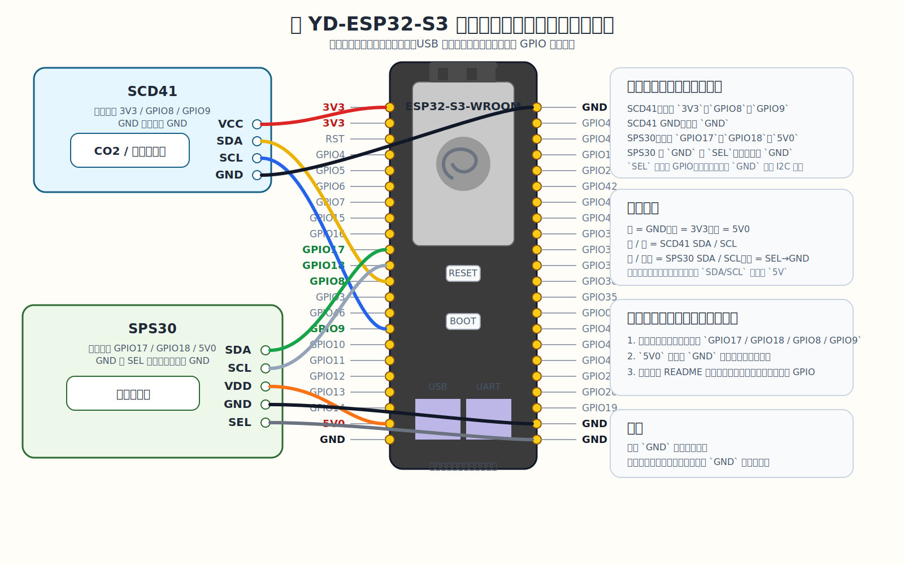

# ESP32-S3 室内空气质量监测节点

基于 `ESP32-S3 + Sensirion SCD41 + Sensirion SPS30` 的室内空气质量监测固件。

当前设计：

- 首次配网使用 `ESP BLE Prov`
- 连上局域网后使用本地网页管理
- 通过 `MQTT Discovery` 自动接入 Home Assistant
- 支持 OTA、重启和恢复出厂

## 当前功能

- `SCD41`：`CO2 / 温度 / 相对湿度`
- `SPS30`：`PM1.0 / PM2.5 / PM4.0 / PM10.0`
- `SPS30`：`0.5 / 1.0 / 2.5 / 4.0 / 10um` 数浓度
- `SPS30`：`Typical Particle Size`
- 本地网页：查看状态、修改 `Wi-Fi / MQTT`、控制传感器、OTA
- `MQTT Discovery` 自动创建设备和实体
- Wi-Fi 长时间离线后自动回到 `BLE 配网模式`

## 硬件

- 主控：`YD-ESP32-S3`
- SDK：`ESP-IDF v5.5.3`
- 传感器：`SCD41 + SPS30`

说明：

- 板载 `WS2812 RGB LED` 占用 `GPIO48`
- 当前工程不使用 `GPIO48`

## 默认接线

### SCD41

- `VCC -> 3V3`
- `GND -> GND`
- `SDA -> GPIO8`
- `SCL -> GPIO9`

### SPS30

- `VDD -> 5V0`
- `GND -> GND`
- `SEL -> GND`
- `SDA -> GPIO17`
- `SCL -> GPIO18`

接线注意：

- `SEL` 必须接 `GND`，否则 `SPS30` 不会进入 I2C 模式
- 两条 I2C 的上拉都必须在 `3.3V` 逻辑域
- 杜邦线尽量控制在 `10 cm` 内



## 首次使用

### 1. 烧录固件

```bash
source ~/.espressif/v5.5.3/esp-idf/export.sh
idf.py build
idf.py -p /dev/cu.wchusbserialXXXX flash monitor
```

建议优先使用板子右侧 `USB to UART` 口烧录和看日志。

### 2. BLE 配网

首次上电、或者没有保存过 Wi-Fi 凭据时，设备会进入 `ESP BLE Prov`。

- BLE Service Name：`airmon-<device_id>`
- PoP：`<device_id>`

`device_id` 是设备 MAC 后 3 字节的小写十六进制字符串，串口日志也会打印出来。

建议使用 Espressif 官方 `ESP BLE Prov` App 或兼容客户端下发 Wi-Fi。

### 3. 网页补充 MQTT 配置

BLE 配网只负责把设备接入局域网。

设备拿到 IP 后：

- 用浏览器访问设备 IP
- 在网页里补充 `MQTT Host` 等参数
- 保存后设备会自动重启

如果还没填 `MQTT Host`，设备会先联网，但不会启动 MQTT。

## 运行逻辑

- 有 Wi-Fi 凭据时，设备以 `STA` 模式启动
- 连上局域网后启动网页控制台
- `MQTT Host` 已配置时才启动 MQTT 并发布 Discovery
- MQTT 断线后会自动重连，恢复后会重新发布 Discovery
- 恢复出厂后会清空配置并重新进入 `BLE Provisioning`
- 当前网页管理端口 **不带登录认证**，仅适合你信任的局域网

## MQTT / Home Assistant

默认值：

- `device_name = aq-monitor-<device_id>`
- `discovery_prefix = homeassistant`
- `topic_root = air_quality_monitor/<device_id>`
- `mqtt_port = 1883`
- `publish_interval_sec = 10`

设备主要发布：

- 传感器数据：`CO2 / 温湿度 / PM / 粒子数 / Typical Particle Size`
- 诊断数据：`RSSI / Uptime / Heap / Firmware / Last Error`
