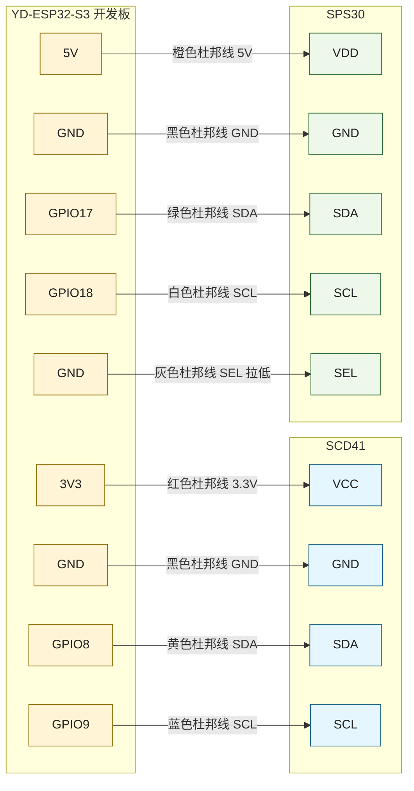

# ESP32-S3 室内空气质量监测节点

这是一个基于 `ESP32-S3 + Sensirion SCD41 + Sensirion SPS30` 的室内空气质量监测固件工程，目标是做一台可以长期上电运行、自动接入 Home Assistant、并支持本地网页配网与 OTA 升级的空气质量节点。

命名规范统一为：

- 仓库目录建议使用 `air-quality-monitor`
- CMake 工程名使用 `air_quality_monitor`
- 面向用户的标题继续使用自然语言名称“室内空气质量监测节点”

当前工程已经实现并编译通过以下功能：

- `SCD41` 采集 `CO2 / 温度 / 相对湿度`
- `SPS30` 采集 `PM1.0 / PM2.5 / PM4.0 / PM10.0`
- `SPS30` 采集 `0.5 / 1.0 / 2.5 / 4.0 / 10um` 数浓度
- `SPS30` 采集 `Typical Particle Size`
- 通过 `MQTT Discovery` 自动接入 Home Assistant
- 首次启动无配置时自动进入 `SoftAP + 本地网页`
- 网页支持查看状态、改 Wi-Fi / MQTT、切换控制、OTA 上传
- 配置保存在 `NVS`
- Wi-Fi 长时间离线时自动回退到 `AP 模式`

---

## 1. 项目定位

这个项目适合下面这类场景：

- 放在室内持续通电运行
- 周期上报空气质量数据到 Home Assistant
- 不想手写大量 HA YAML
- 需要后续改 Wi-Fi / MQTT 参数
- 需要本地 OTA 升级

当前设计假设设备运行在你信任的局域网里，所以网页管理端口默认 **不带登录认证**。这不是面向公网暴露的安全设计。

---

## 2. 本版硬件方案

### 2.1 主控

- `YD-ESP32-S3` 开发板
- `ESP-IDF v5.5.3`
- 板上有两个 `Type-C`
  - 左侧是 `USB&OTG`，直连 ESP32-S3 原生 USB
  - 右侧是 `USB to UART`，通过 `CH343P` 接到串口
- 板载 `WS2812 RGB LED` 固定占用 `GPIO48`
- 当前工程没有使用 `GPIO48`，避免和板载 RGB 灯冲突

### 2.2 传感器

- `SCD41`
  - I2C 接口
  - 读取 `CO2 / 温度 / 湿度`
  - 使用 `3.3V`
  - 默认温度偏移按 Sensirion 数据手册采用 `4.0°C`

- `SPS30`
  - I2C 接口
  - 读取 `PM1.0 / PM2.5 / PM4.0 / PM10.0`
  - 读取 `0.5 / 1.0 / 2.5 / 4.0 / 10um` 数浓度
  - 读取 `Typical Particle Size`
  - 供电采用 `5V`
  - `SEL` 拉低进入 I2C 模式

### 2.3 为什么改成 SPS30

这版工程不再使用 `PMS7003 UART + SET/RESET` 方案，而是改成了 `SPS30 I2C`，主要变化是：

- `SCD41` 和 `SPS30` 现在拆成两条独立 I2C 总线
- 默认接线更适合杜邦线原型，不需要在 `SDA/SCL` 上做一分二
- 不再需要 `GPIO15 / GPIO16` 这组 PMS7003 控制引脚
- `GPIO17 / GPIO18` 改作 `SPS30` 的独立 I2C
- 数据模型从 PMS7003 的 `0.3/0.5/1.0/2.5/5.0/10um` 改成 SPS30 原生的 `0.5/1.0/2.5/4.0/10um`
- 新增 `PM4.0` 和 `Typical Particle Size`

---

## 3. 当前固件默认 GPIO

定义位置在 `components/platform/Kconfig`，当前默认值如下：

- `SCD41 I2C Port = 0`
- `SCD41 SDA = GPIO8`
- `SCD41 SCL = GPIO9`
- `SPS30 I2C Port = 1`
- `SPS30 SDA = GPIO17`
- `SPS30 SCL = GPIO18`
- `SPS30 预热时间 = 30 秒`

也就是说：

- `SCD41` 独立接到 `GPIO8 / GPIO9`
- `SPS30` 独立接到 `GPIO17 / GPIO18`
- 两颗传感器不再需要共用 `SDA/SCL`

---

## 4. 接线原则

### 4.1 电压

- `SCD41 -> 3.3V`
- `SPS30 -> 5V`

补充说明：

- `SCD41` 数据手册要求电源噪声尽量低，最好来自稳定的 `LDO`
- `YD-ESP32-S3` 板上有独立 `3V3` LDO，适合作为 `SCD41` 供电
- `SPS30` 的供电按数据手册采用 `5V`

### 4.1.1 I2C 上拉必须按 3.3V 逻辑处理

`SCD41` 和 `SPS30` 都要求 I2C 总线有上拉，但你这套系统的 I2C 主机是 `ESP32-S3 3.3V GPIO`，所以两条总线的高电平都必须落在 `3.3V` 域。

- `SCD41` 那条 `SDA/SCL` 上拉应接到 `3.3V`
- `SPS30` 那条 `SDA/SCL` 上拉也应接到 `3.3V`
- 如果你用的是传感器模块，很多模块已经自带上拉
- 如果模块没有上拉，按 Sensirion 资料可补 `4.7kΩ ~ 10kΩ` 到 `3.3V`
- 不要把 I2C 上拉接到 `5V`，否则会把 `ESP32-S3` 的 `GPIO8/GPIO9` 或 `GPIO17/GPIO18` 拉到 5V

当前固件里开启了 ESP32 内部上拉，主要用于开发阶段兜底；正式接线时仍应保证总线上存在符合资料要求的外部上拉或模块自带上拉。

### 4.2 共地

`ESP32-S3`、`SCD41`、`SPS30` 的 `GND` 必须互相连通。

这块 `YD-ESP32-S3` 板子上标出来的多个 `GND` 在板内本来就是同一个地网，所以：

- `SCD41 GND` 接一个 `GND`
- `SPS30 GND` 接另一个 `GND`

这依然是标准共地。

### 4.3 双 I2C 独立接线

当前默认接线是两条独立 I2C：

- `SCD41 SDA -> ESP32 GPIO8`
- `SCD41 SCL -> ESP32 GPIO9`
- `SPS30 SDA -> ESP32 GPIO17`
- `SPS30 SCL -> ESP32 GPIO18`

这样做的直接好处是：

- 不需要在 `GPIO8/GPIO9` 上做物理分线
- 更适合杜邦线原型和 `20cm` 级别线长
- `SPS30` 和 `SCD41` 的信号走线更清晰，排错更容易

按 `SPS30` 数据手册，I2C 更适合短距离板内或近距离连线；拆成双总线后，虽然仍建议尽量短，但比“单总线再分叉”更稳一些：

- 线长尽量控制在 `< 10 cm`
- 如果无法很短，至少要尽量屏蔽并减小串扰
- 如果未来传感器必须离主板更远，Sensirion 更推荐改用 `UART/SHDLC`

### 4.4 SPS30 的 SEL 脚必须拉低

`SPS30` 要使用 I2C，`SEL` 必须接 `GND`，并且最好在上电前就已经接好。

如果 `SEL` 没接地：

- 传感器可能不会进入 I2C 模式
- 固件会表现为 `SPS30 init failed` 或一直无数据

---

## 5. 最终接线表

下面这份是“和当前固件默认配置完全一致”的最终接线表。

### 5.1 设备端到 ESP32 的最终接线

| 设备 | 设备端引脚 | 接到 ESP32 哪个孔 | 板上标识 | 说明 |
|---|---|---|---|---|
| `SCD41` | `VCC` | 左侧最上方任意一个 `3V3` | `3V3` | SCD41 供电 |
| `SCD41` | `GND` | 任意一个 `GND` | `GND` | 与 ESP32 共地 |
| `SCD41` | `SDA` | 左侧标 `8` 的孔 | `GPIO8` | I2C 数据 |
| `SCD41` | `SCL` | 左侧标 `9` 的孔 | `GPIO9` | I2C 时钟 |
| `SPS30` | `VDD` | 左下方 `5V` 孔 | `5V` | SPS30 推荐 5V |
| `SPS30` | `SDA` | 左侧标 `17` 的孔 | `GPIO17` | SPS30 独立 I2C 数据 |
| `SPS30` | `SCL` | 左侧标 `18` 的孔 | `GPIO18` | SPS30 独立 I2C 时钟 |
| `SPS30` | `SEL` | 任意一个 `GND` | `GND` | 必须拉低，选择 I2C 模式 |
| `SPS30` | `GND` | 任意一个 `GND` | `GND` | 共地 |

### 5.2 一眼看懂版

- `ESP32 3V3 -> SCD41 VCC`
- `ESP32 GND -> SCD41 GND`
- `ESP32 GPIO8 -> SCD41 SDA`
- `ESP32 GPIO9 -> SCD41 SCL`
- `ESP32 5V -> SPS30 VDD`
- `ESP32 GPIO17 -> SPS30 SDA`
- `ESP32 GPIO18 -> SPS30 SCL`
- `ESP32 GND -> SPS30 SEL`
- `ESP32 GND -> SPS30 GND`

### 5.2.1 杜邦线接线图

下面这张图按“`YD-ESP32-S3 + SCD41 + SPS30`，全部使用杜邦线直连”的方式画。

- 线色只是推荐，方便你实际插线时不容易插错
- `GND` 在板内本来就是共地，所以图里用了多个 `GND` 点位来减少交叉线
- 两条 I2C 都要保持在 `3.3V` 逻辑域，不要把 `SDA/SCL` 上拉到 `5V`



如果你手头杜邦线颜色不够，至少建议保持下面这套映射不变：

- 电源线和数据信号线不要混色
- `3V3` 和 `5V` 最好用两种明显不同的暖色
- 两条 `GND` 可以都用黑色
- `SDA` / `SCL` 在同一颗传感器上尽量固定成一组颜色

### 5.3 如果你用的是独立 5V 给 SPS30 供电

如果后续你发现板载 USB 供电带 `SPS30` 风扇不够稳，可以单独给 `SPS30` 上 `5V` 电源。此时一定要保证：

- 外部 `5V+ -> SPS30 VDD`
- 外部 `5V- -> SPS30 GND`
- 外部 `5V-` 同时还要接到 `ESP32 任意 GND`

也就是：

- 外部供电可以分开
- 但地线绝对不能断开

---

## 6. 关于 YD-ESP32-S3 板上的 GND

你这块板子上有多个 `GND`，它们内部是相通的。

所以你完全可以这样接：

- `SCD41 GND -> 右下角 GND`
- `SPS30 GND -> 左下角 GND`
- `SPS30 SEL -> 另一个 GND`

这依然算标准共地。

---

## 7. 为什么当前默认拆成两组 I2C

因为两颗传感器的 I2C 地址不同：

- `SCD41 = 0x62`
- `SPS30 = 0x69`

所以它们其实可以挂在同一条总线上，不会地址冲突。

但当前工程默认没有这样做，而是拆成两组：

- `SCD41 -> I2C0 GPIO8/9`
- `SPS30 -> I2C1 GPIO17/18`

这样选型的原因是：

- 更适合杜邦线接线
- 不需要做 `SDA/SCL` 分线
- 对较长原型线更宽容
- 出问题时能更快区分是 `SCD41` 还是 `SPS30` 那一侧

当前两条总线都使用 `100kHz I2C`。

---

## 8. 当前固件的传感器行为

### 8.1 SCD41

- 上电后进入周期测量模式
- 固件每秒检查一次是否有新数据
- 周期测量的默认数据节奏约 `5 秒`
- 拿到数据后更新：
  - `co2`
  - `temperature`
  - `humidity`

支持：

- 海拔补偿
- 温度偏移补偿
- ASC 开关
- FRC 强制校准

设计细节：

- `SCD41` 默认 I2C 地址是 `0x62`
- 固件默认把温度偏移初始化为 `4.0°C`
  - 这是 Sensirion 手册给出的默认值
  - 真正最合适的偏移量仍应在最终整机结构、典型风道和热平衡状态下标定
- 当前工程不调用 `persist_settings` 把这些参数永久写进传感器 EEPROM
  - 配置保存在 `ESP32 NVS`
  - 每次启动时重新下发到 `SCD41`
  - 这样可以避免频繁写传感器内部 EEPROM

### 8.1.1 SCD41 校准前提

按 Sensirion 数据手册：

- `FRC` 前，传感器必须在未来正常使用的测量模式下运行至少 `3 分钟`
- 环境中的 `CO2` 必须均匀且稳定
- `ASC` 若保持启用，需要设备每周有机会暴露在大约 `400 ppm` 的新鲜空气环境中

当前固件已经做了其中一条硬约束：

- 若 `SCD41` 进入周期测量后还不到 `3 分钟`，会拒绝执行 `FRC`

### 8.2 SPS30

- 上电后通过 I2C 启动测量
- 固件轮询 `data ready`
- 有新数据后读取：
  - `PM1.0`
  - `PM2.5`
  - `PM4.0`
  - `PM10.0`
  - `0.5 / 1.0 / 2.5 / 4.0 / 10um` 数浓度
  - `Typical Particle Size`

设计细节：

- `SPS30` 默认 I2C 地址是 `0x69`
- SPS30 独立总线速率固定为 `100kHz`
  - 这符合 `SPS30` I2C 的上限要求
- `Typical Particle Size` 使用的是 `I2C float 输出格式`
  - 单位是 `µm`

### 8.3 SPS30 预热逻辑

当前固件在以下场景会重新预热：

- 设备刚上电
- 从 `SPS30 Sleep` 唤醒后

预热规则：

- 默认预热 `30 秒`
- 这段时间内固件会继续读 SPS30
- 但不会把数据标记为最终有效值
- 30 秒后才开始更新 `pm_valid`

这样做是为了避免风扇刚启动、流量和颗粒统计尚未稳定时就把数据推给 Home Assistant。

这个 `30 秒` 预热窗口是按 Sensirion 数据手册的最慢稳定场景取保守值：

- `200–3000 #/cm³` 典型启动时间约 `8 秒`
- `100–200 #/cm³` 典型启动时间约 `16 秒`
- `50–100 #/cm³` 典型启动时间约 `30 秒`

---

## 9. Home Assistant 中会出现的实体

### 9.1 主测量实体

- `co2`
- `temperature`
- `humidity`
- `pm1_0`
- `pm2_5`
- `pm4_0`
- `pm10_0`
- `particles_0_5um`
- `particles_1_0um`
- `particles_2_5um`
- `particles_4_0um`
- `particles_10_0um`
- `typical_particle_size_um`

### 9.2 诊断实体

- `wifi_rssi`
- `uptime_sec`
- `heap_free`
- `firmware_version`
- `last_error`

### 9.3 控制实体

- `restart`
- `factory_reset`
- `republish_discovery`
- `scd41_asc`
- `sps30_sleep`
- `scd41_frc_reference_ppm`
- `apply_scd41_frc`

---

## 10. MQTT 主题设计

默认主题根路径：

- `air_quality_monitor/<device_id>/`

固定主题：

- `air_quality_monitor/<device_id>/state`
- `air_quality_monitor/<device_id>/diag`
- `air_quality_monitor/<device_id>/availability`
- `air_quality_monitor/<device_id>/cmd/...`

### 10.1 状态主题

`state` 中会发布主测量 JSON，包含：

- `co2`
- `temperature`
- `humidity`
- `pm1_0`
- `pm2_5`
- `pm4_0`
- `pm10_0`
- `particles_0_5um`
- `particles_1_0um`
- `particles_2_5um`
- `particles_4_0um`
- `particles_10_0um`
- `typical_particle_size_um`
- `sps30_sleeping`
- `scd41_asc_enabled`
- `scd41_frc_reference_ppm`

### 10.2 诊断主题

`diag` 中会发布：

- `wifi_rssi`
- `uptime_sec`
- `heap_free`
- `firmware_version`
- `last_error`

### 10.3 命令主题

当前会订阅：

- `.../cmd/restart`
- `.../cmd/factory_reset`
- `.../cmd/republish_discovery`
- `.../cmd/scd41_asc`
- `.../cmd/sps30_sleep`
- `.../cmd/scd41_frc_reference_ppm`
- `.../cmd/apply_scd41_frc`

---

## 11. 本地网页控制台

网页提供这些区域：

- `Status`
- `Telemetry`
- `Wi-Fi & MQTT`
- `Sensor Controls`
- `OTA Upload`
- `Device Actions`

网页支持的动作：

- 保存 Wi-Fi / MQTT 配置
- 启用 / 关闭 `SCD41 ASC`
- 唤醒 / 休眠 `SPS30`
- 触发 `SCD41 FRC`
- 手动重新发布 Discovery
- 重启
- 恢复出厂设置
- 上传新固件 OTA

### 11.1 当前 HTTP API

- `GET /`
- `GET /api/status`
- `POST /api/config`
- `POST /api/action/restart`
- `POST /api/action/factory-reset`
- `POST /api/action/republish-discovery`
- `POST /api/action/scd41-asc`
- `POST /api/action/sps30-sleep`
- `POST /api/action/apply-frc`
- `POST /api/ota`

---

## 12. 工程结构

### 12.1 `main/`

- `app_main.c`
  - 启动顺序
  - Wi-Fi / MQTT 生命周期
  - 周期发布
  - 配置保存后重启
  - 工厂重置

### 12.2 `components/platform/`

- `platform_config.c`
  - NVS 存储配置
- `platform_wifi.c`
  - AP / STA 切换
  - 重连与回退

### 12.3 `components/sensors/`

- `scd41.c`
  - SCD41 命令实现
- `sps30.c`
  - SPS30 I2C 驱动
  - 休眠 / 唤醒
  - 数据就绪判断
  - 测量值解析
- `sensors.c`
  - 共享 I2C 总线
  - 传感器任务
  - 预热窗口
  - 平滑平均

### 12.4 `components/mqtt_ha/`

- `mqtt_ha.c`
  - MQTT Discovery
  - 状态发布
  - 命令订阅与分发

### 12.5 `components/provisioning_web/`

- `provisioning_web.c`
  - 网页控制台
  - JSON API
  - OTA 上传

---

## 13. 编译与烧录

### 13.1 环境前提

当前工程按 `ESP-IDF v5.5.3` 编译。

### 13.2 推荐目录命名

建议把仓库目录命名为：

- `/path/to/air-quality-monitor`

避免使用空格、大小写混用，或把具体传感器型号直接堆进目录名；这样更利于构建脚本、CI 和长期维护。

### 13.3 推荐构建方式

```bash
export IDF_PATH=$HOME/.espressif/v5.5.3/esp-idf
export IDF_PYTHON_ENV_PATH=$HOME/.espressif/python_env/idf5.5_py3.14_env
. $IDF_PATH/export.sh

ln -sfn '/path/to/air-quality-monitor' /tmp/air-quality-monitor-src

python $IDF_PATH/tools/idf.py -C /tmp/air-quality-monitor-src -B /tmp/air-quality-monitor-build build
```

如果 `idf.py` 又因为路径空格报“configured for project ... not ...”之类的错误，可以直接继续使用已生成的构建目录：

```bash
cmake --build /tmp/air-quality-monitor-build
```

### 13.4 烧录

```bash
python $IDF_PATH/tools/idf.py -C /tmp/air-quality-monitor-src -B /tmp/air-quality-monitor-build -p /dev/cu.wchusbserialXXXX flash
```

### 13.5 串口监视

```bash
python $IDF_PATH/tools/idf.py -C /tmp/air-quality-monitor-src -B /tmp/air-quality-monitor-build -p /dev/cu.wchusbserialXXXX monitor
```

对这块 `YD-ESP32-S3`，当前工程更推荐这样用口：

- 烧录和看日志优先接右侧 `USB to UART` 口
- 这个口走 `CH343P`，在 macOS 上通常会枚举成 `/dev/cu.wchusbserial*` 或近似名称
- 左侧 `USB&OTG` 是 ESP32-S3 原生 USB，当前工程没有把它作为主要串口说明口来依赖

### 13.6 当前构建结果

最近一次验证构建已经成功通过：

- 输出文件：`/tmp/air-quality-monitor-build-check/air_quality_monitor.bin`
- 固件大小约：`0xdd1b0`
- OTA 分区剩余空间约：`42%`

---

## 14. 首次上电流程

### 14.1 没有配置时

- 设备启动
- 检测到 Wi-Fi / MQTT 配置不完整
- 自动进入 `SoftAP`
- 打开本地网页配置

### 14.2 有配置时

- 设备进入 `STA 模式`
- 连接 Wi-Fi
- 建立 MQTT
- 发布 `availability`
- 发布 MQTT Discovery
- 周期推送状态

### 14.3 掉线恢复

- Wi-Fi 断开后自动重连
- MQTT 断开后自动重连
- MQTT 恢复后会重新发布 Discovery
- 若离线太久，自动回到 `AP 模式`

---

## 15. 使用 SPS30 时最容易犯的错误

### Q1：SPS30 一直初始化失败

优先检查：

- `SEL` 有没有接 `GND`
- `VDD` 有没有接 `5V`
- `GND` 有没有和 ESP32 共地
- `SDA/SCL` 有没有和 `GPIO17/GPIO18` 接对

### Q2：SPS30 有时有数据，有时没有

优先检查：

- I2C 线是不是超过 `10 cm`
- `GPIO17 / GPIO18` 是否被别的外设占用
- 供电是否稳定
- SPS30 这条总线上是否真的有拉到 `3.3V` 的 I2C 上拉

### Q3：SPS30 明明上电了，但 Home Assistant 一直是空值

先看是不是预热期：

- 固件默认会忽略前 `30 秒` 数据
- 刚上电或刚从睡眠唤醒时，这是正常现象

### Q4：SPS30 休眠后唤醒很慢

这是当前固件的设计结果：

- 唤醒后会重新开始测量
- 同时重新进入 `30 秒` 预热窗口

### Q5：为什么现在不用给 `GPIO8/GPIO9` 分线了

因为当前默认方案已经拆成双 I2C：

- `SCD41` 只用 `GPIO8/GPIO9`
- `SPS30` 只用 `GPIO17/GPIO18`

如果你未来想再改回“共享一条 I2C”，从协议上也是可行的，但那需要重新改固件默认 GPIO 和接线。

---

## 16. 已知限制

- 当前网页管理口默认无认证，只适合受信任内网
- 当前 MQTT 使用账号密码，不启用 TLS
- 当前没有把 `SPS30 风扇清洁` 暴露为网页或 MQTT 控件
- 当前没有做公网部署、安全加固和权限体系
- 当前假设 `SCD41` 与 `SPS30` 距离主板较近，虽然已拆成双 I2C，但线依然不宜太长
- 当前 `ASC` 的效果仍取决于设备是否真的能周期性暴露在约 `400 ppm` 新鲜空气环境

---

## 17. 后续可扩展方向

如果你后面想继续升级，这个项目比较适合往下面这些方向扩展：

- 给网页管理口加认证
- 给 MQTT 加 TLS
- 把 `SPS30 Fan Cleaning` 做成 HA 按钮实体
- 新增历史缓存或本地日志
- 新增实体命名自定义
- 新增多点校准流程

---

## 18. 你现在最该做的事

如果你准备开始实际接线，建议顺序如下：

1. 先只接 `SCD41`
2. 确认 `SCD41` 正常出 `CO2 / 温湿度`
3. 再把 `SPS30` 接到独立的 `GPIO17 / GPIO18`
4. 确认 `SEL` 已经接地
5. 等 `30 秒` 预热结束再看 PM 值
6. 最后再接入 Home Assistant 验证 Discovery

这样定位问题会最清楚。
